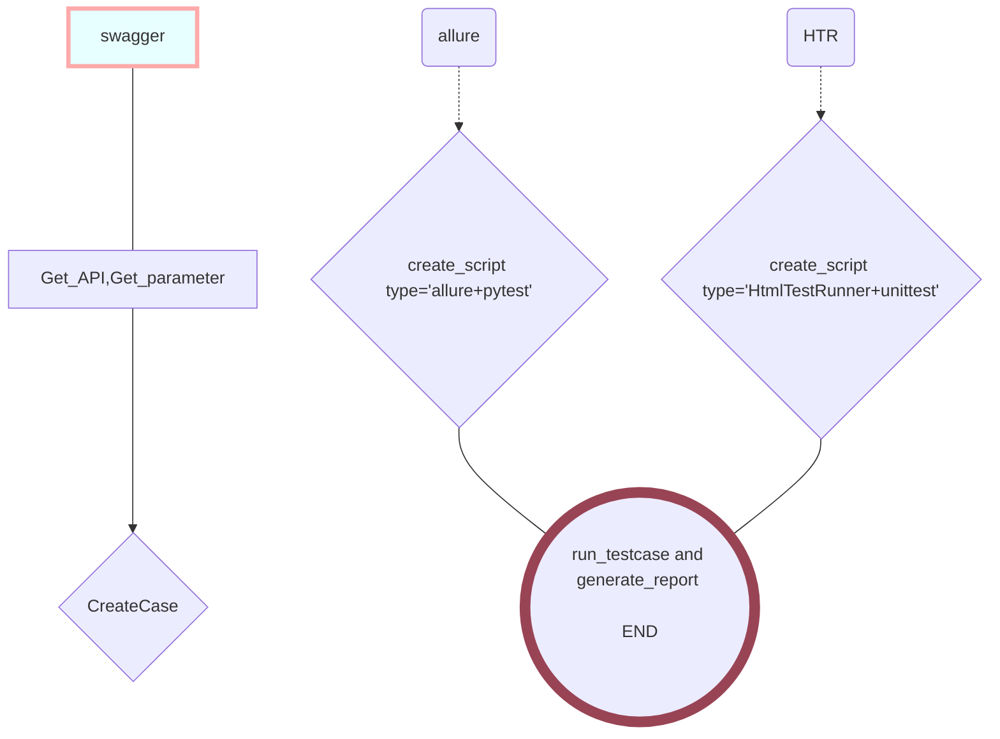

# interfaceTest
  接口自动化测试库

# 注意事项
 需提前下载allure2并配置路径
#requests官方文档   
    https://docs.python-requests.org/zh_CN/latest/
  
 # 目录说明
 ```
.
├─ BasicVersion 
│    └─ baseic.py   # 基础用法
├─ Integrate_request
│    └─ BaseUtil.py  # 整合常用的请求方法
├─ README.md    
├─ Report
│    └─ 存放测试报告的地方
├─ TestCases
│    ├─ __pycache__
│    │    └─ test.cpython-37.pyc
│    └─ test.py # 例子
├─ requirements.txt
└─ run.py # 运行文件
```

 # 使用方法
```python
from interfaceTest.PublicMethod.run_testcase import BeforeRun, Run
BeforeRun('url', 'api', '接口文件.csv', '参数文档存储路径', '用例路径')
Run('用例路径', '脚本1.py', '脚本2.py', 'path里的python名') #RUN 写完参数后运行
```

# 流程图



